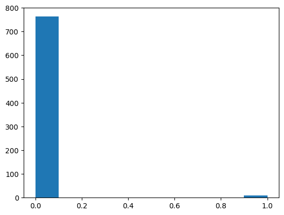
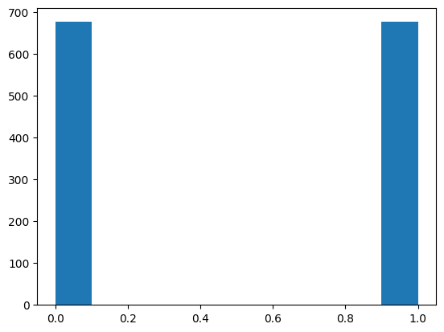

## Model Performance Across Different Samples

This README file presents the results of evaluating five machine learning models (Logistic Regression, K-Nearest Neighbors, Support Vector Machine, Decision Tree, and Random Forest) on multiple samples of a dataset.

**Methodology:**

1. **Data Preparation:** 
    Original Dataset: The initial dataset exhibited class imbalance.
    

    SMOTE Preprocessing: To address the class imbalance, the Synthetic Minority Over-sampling Technique (SMOTE) was applied to the dataset, generating synthetic samples for the minority class.
    

   - **Multiple samples were generated using the following techniques:**
      - Simple Random Sampling  (Sample 1)
      - Bootstrap Sampling (Sample 2)
      - Cluster Sampling (Sample 3)
      - Systematic Sampling (Sample 4)
      - Stratified Sampling  (Sample 5)

2. **Model Training and Evaluation:**
   - Each model was trained and evaluated on each of the generated samples.
   - Model performance was measured using accuracy.

**Results:**

The following table summarizes the accuracy scores of each model across the different samples:

| Model Name             | Sample 1 | Sample 2 | Sample 3 | Sample 4 | Sample 5 |
|------------------------|----------|----------|----------|----------|----------|
| Logistic Regression    | 0.953202 | 0.953202 | 0.953202 | 0.953202 | 0.953202 |
| K-Nearest Neighbors    | 0.839901 | 0.839901 | 0.714286 | 0.839901 | 0.839901 |
| Support Vector Machine | 0.714286 | 0.714286 | 0.714286 | 0.714286 | 0.714286 |
| Decision Tree          | 0.985222 | 0.985222 | 0.985222 | 0.985222 | 0.985222 |
| Random Forest          | 0.990148 | 0.990148 | 0.990148 | 0.990148 | 0.990148 |

**Observations:**

- **Consistent Performance:** Logistic Regression and K-Nearest Neighbors exhibit consistent performance across all samples.
- **High Accuracy:** Decision Tree and Random Forest consistently achieve high accuracy scores, indicating their potential as strong performers for this dataset.
- **SVM Variation:** Support Vector Machine shows some variation in accuracy across samples.